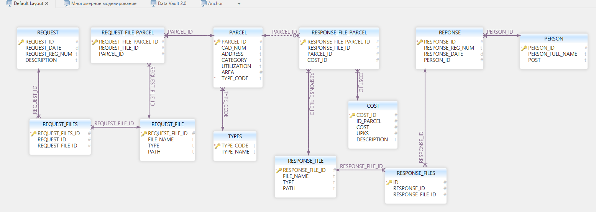

**Предметная область**: государственная кадастровая оценка.

**Анализ предметной области**: основной сущностью в данном процессе является объект недвижимости – parcel. У объекта недвижимости следующие атрибуты: кадастровый номер(текст – cad_num), адрес(текст - address), категория(текст - category), разрешенное использование(текст - utilization), площадь(вещ.число - area), тип объекта(код - текст). Объекты оценки приходят в организацию от другой организации в виде запросов на оценку(архив файлов) – request. Запрос: номер запроса и дата. По окончании оценки, а это cost(стоимость всего объекта) и upks(удельный показатель кадастровой стоимости за единицу площади), файлы с данными уходят обратно в «другую организацию».

Основные сведения, которые интересуют организацию это:

- когда, сколько и с какими реквизитами пришли/ушли объекты;

- кто произвёл оценку(person) и сколько объектов;

- какую цену присвоили объекту и с какими характеристиками(utilization, category, area, …) они были в момент оценки.

### ER OLTP:

### ER DIMENSIONAL:

### ER DV:

### ER ANCHOR:

